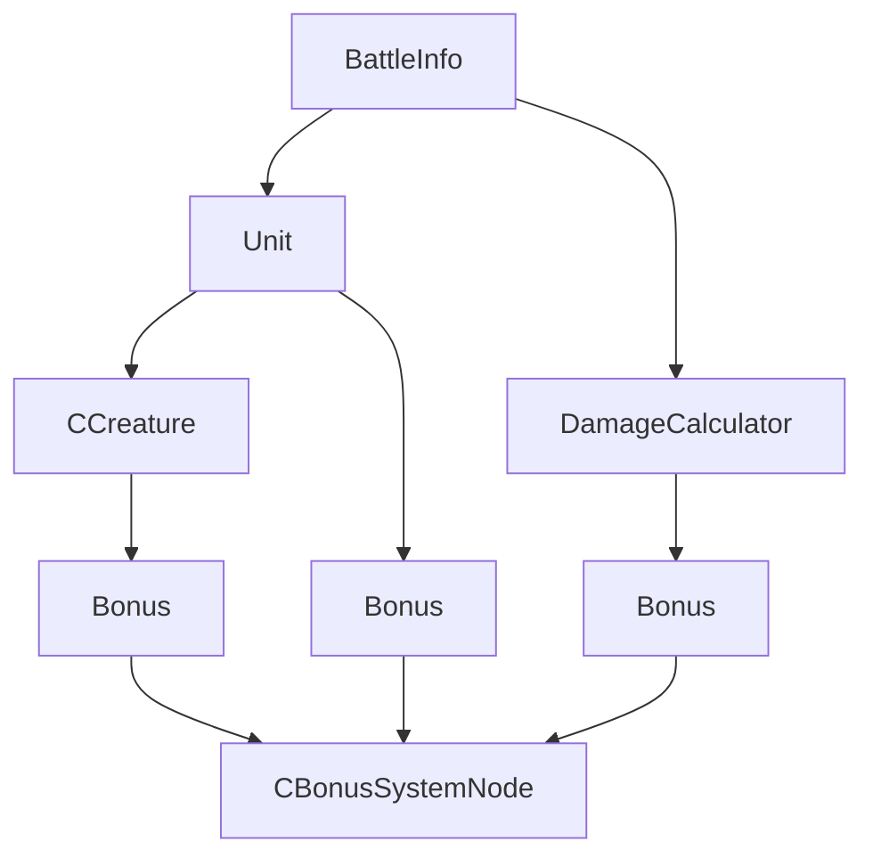
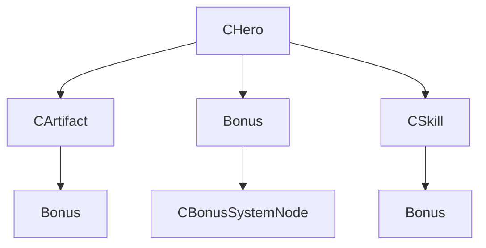
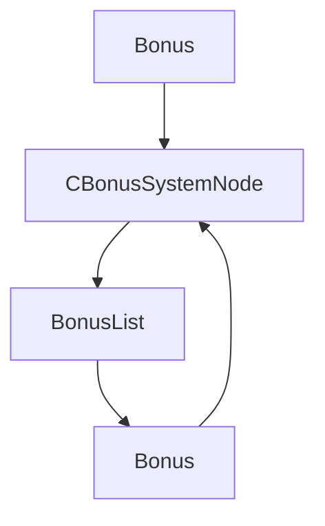

# 依赖关系分析

本节基于 VCMI 客户端核心库头文件的实际 `#include` 语句分析各个类和模块之间的依赖关系。

## 🏗️ 依赖层级架构

通过分析头文件的引用关系，VCMI 核心库的依赖层级如下：

### 底层基础模块 (Level 1)
这些是最基础的模块，几乎不依赖其他模块：

- **serializer/**: 数据序列化/反序列化 (`Serializeable.h`)
- **filesystem/**: 文件系统操作 (`ResourcePath.h`)
- **texts/**: 文本处理 (`MetaString.h`)
- **constants/**: 游戏常量 (`EntityIdentifiers.h`, `GameConstants.h`)

### 中间层 - 奖励系统 (Level 2)
奖励系统是核心的基础设施：

- **bonuses/**: 奖励系统
  - `Bonus.h` - 奖励基类（依赖：serializer/, filesystem/, texts/, constants/）
  - `BonusList.h` - 奖励列表（依赖：Bonus.h）
  - `CBonusSystemNode.h` - 奖励系统节点（依赖：BonusList.h, IBonusBearer.h, serializer/）

### 中间层 - 回调系统 (Level 3)
提供游戏状态访问接口：

- **callback/**: 回调系统
  - `GameCallbackHolder.h` - 游戏回调持有者
  - `CNonConstInfoCallback.h` - 非常量信息回调

### 实体层模块 (Level 4)
定义游戏实体，依赖奖励系统：

- **entities/**: 游戏实体系统
  - `CHero.h` - 英雄实体（依赖：HeroType.h, BonusList.h, constants/, filesystem/）
  - `CArtifact.h` - 神器实体（依赖：CBonusSystemNode.h, ArtifactLocation.h, Artifact.h）
  - `CTown.h` - 城镇实体（依赖：building/, Point.h, constants/, filesystem/, int3.h）
  - `CCreature` - 生物实体（依赖：bonuses/, constants/，原始代码中定义）

### 战斗层模块 (Level 5)
实现战斗逻辑，依赖实体层：

- **battle/**: 战斗系统
  - `BattleInfo.h` - 战斗信息（依赖：CBattleInfoCallback.h, IBattleState.h, SideInBattle.h, SiegeInfo.h, GameCallbackHolder.h, Bonus.h, CBonusSystemNode.h）
  - `Unit.h` - 战斗单位（依赖：Creature.h, Caster.h, Bonus.h, IBonusBearer.h, IUnitInfo.h, BattleHexArray.h）
  - `DamageCalculator.h` - 伤害计算（依赖：GameConstants.h）
  - `BattleAction.h` - 战斗动作（依赖：battle/ 内部类）
  - `CStackInstance.h` - 栈实例（依赖：battle/, entities/, bonuses/）

### 游戏状态层 (Level 6)
最高层，管理全局游戏状态：

- **gameState/**: 游戏状态管理
  - `CGameState.h` - 全局游戏状态（依赖：CBonusSystemNode.h, callback/, entities/, gameState/ 内部类）
  - `CPlayerState` - 玩家状态（依赖：gameState/, bonuses/）

## 📊 详细依赖关系图

### 战斗系统依赖关系

```
BattleInfo
├── battle/ (CBattleInfoCallback, IBattleState, SideInBattle, SiegeInfo)
├── callback/ (GameCallbackHolder)
└── bonuses/ (Bonus, CBonusSystemNode)

Unit
├── vcmi/ (Creature, spells/Caster)
├── bonuses/ (Bonus, IBonusBearer)
└── battle/ (IUnitInfo, BattleHexArray)

DamageCalculator
└── GameConstants (constants/)

BattleAction
├── battle/ (Destination)
└── GameConstants (constants/)

CStackInstance
├── mapObjects/army/ (CStackBasicDescriptor)
├── CCreatureHandler.h
├── bonuses/ (BonusCache, CBonusSystemNode)
├── callback/ (GameCallbackHolder)
├── entities/artifact/ (CArtifactSet)
└── mapObjects/ (CGObjectInstance)
```

### 实体系统依赖关系

```
CHero
├── vcmi/ (HeroType)
├── bonuses/ (BonusList)
├── constants/ (EntityIdentifiers)
└── filesystem/ (ResourcePath)

CArtifact
├── entities/artifact/ (ArtBearer, EArtifactClass)
├── bonuses/ (CBonusSystemNode)
├── networkPacks/ (ArtifactLocation)
└── vcmi/ (Artifact)

CTown
├── entities/building/ (TownFortifications)
├── Point.h
├── constants/ (EntityIdentifiers, Enumerations)
├── filesystem/ (ResourcePath)
└── int3.h

CCreature (原始代码)
├── bonuses/ (CBonusSystemNode)
├── constants/ (EntityIdentifiers)
└── vcmi/ (Creature 基类)
```

### 奖励系统依赖关系

```
Bonus
├── bonuses/ (BonusEnum, BonusCustomTypes, Limiters)
├── serializer/ (Serializeable)
├── texts/ (MetaString)
└── filesystem/ (ResourcePath)

BonusList
└── bonuses/ (Bonus, BonusSelector)

CBonusSystemNode
├── bonuses/ (BonusList, IBonusBearer)
└── serializer/ (Serializeable)
```

### 游戏状态系统依赖关系

```
CGameState
├── bonuses/ (CBonusSystemNode)
├── callback/ (CNonConstInfoCallback, GameCallbackHolder)
├── entities/ (EArtifactClass)
├── gameState/ (GameStatistics, RumorState)
└── mapObjects/ (CGObjectInstance)

CPlayerState
├── gameState/ (PlayerState 基类)
└── bonuses/ (相关奖励系统)
```

### 序列化系统依赖关系

```
Serializeable
└── (标记基类，所有序列化类继承)

CSerializer
├── IBinaryReader (接口)
└── IBinaryWriter (接口)
```

### 地图对象系统依赖关系

```
CGObjectInstance
├── IObjectInterface (接口)
├── ObjectTemplate (外观)
├── int3.h (坐标)
├── constants/ (EntityIdentifiers)
├── filesystem/ (ResourcePath)
└── bonuses/ (BonusEnum)
```

## 🔗 关键依赖链

### 核心依赖链 1：战斗系统
```
GameConstants → DamageCalculator → BattleAction → Unit → BattleInfo → CStackInstance → CGameState
```

### 核心依赖链 2：实体系统
```
Bonus → BonusList → CBonusSystemNode → CHero/CArtifact/CTown → CStackInstance → BattleInfo → CGameState
```

### 核心依赖链 3：奖励系统
```
Serializeable → Bonus → BonusList → CBonusSystemNode → 所有实体类和战斗类
```

## 📋 模块间耦合度分析

### 高耦合模块
- **bonuses/**: 被几乎所有其他模块依赖，是核心基础设施
- **battle/**: 依赖多个模块（entities/, bonuses/, callback/）
- **gameState/**: 依赖大部分核心模块

### 低耦合模块
- **serializer/**: 主要被 bonuses/ 使用
- **filesystem/**: 主要被实体类使用
- **texts/**: 主要被 Bonus 类使用

### 建议的架构改进
1. **减少循环依赖**：battle/ 和 entities/ 之间的双向依赖可以优化
2. **接口分离**：将 IBonusBearer 等接口提取到独立模块
3. **依赖注入**：减少直接的头文件包含，增加接口依赖

## 🛠️ 依赖关系验证

本分析基于以下头文件的实际 `#include` 语句：
- **战斗系统**：`BattleInfo.h`, `Unit.h`, `DamageCalculator.h`, `BattleAction.h`, `CStackInstance.h`
- **实体系统**：`CHero.h`, `CArtifact.h`, `CTown.h` (CCreature 在原始代码中)
- **奖励系统**：`Bonus.h`, `BonusList.h`, `CBonusSystemNode.h`
- **游戏状态**：`CGameState.h`, `CPlayerState.h`
- **序列化系统**：`Serializeable.h`, `CSerializer.h`
- **地图对象**：`CGObjectInstance.h`

依赖关系图会随着代码重构而变化，建议定期更新此分析。

### 战斗系统依赖关系



### 实体系统依赖关系



### 奖励系统依赖关系



## 🔗 关键依赖关系说明

### 1. Bonus 系统
- `Bonus` 是整个奖励系统的核心
- `CBonusSystemNode` 提供树状结构支持
- `BonusList` 用于批量管理奖励

### 2. 实体继承关系
- 所有实体类都继承自基础实体类
- 英雄、生物、神器等都有共同的属性管理机制

### 3. 战斗依赖
- 战斗系统高度依赖实体系统
- 伤害计算需要考虑各种奖励和加成

## 📋 循环依赖避免

VCMI 在设计时注意避免循环依赖：

- 使用前向声明 (forward declarations)
- 接口抽象和依赖注入
- 模块化设计，每个模块职责单一

## 🔍 依赖分析工具

如果您需要分析特定类的依赖关系，可以：

1. 查看类的头文件中的 `#include` 语句
2. 使用 IDE 的依赖分析功能
3. 参考本节的依赖图

::: warning 注意
依赖关系可能会随着版本更新而变化，请以实际代码为准。
:::